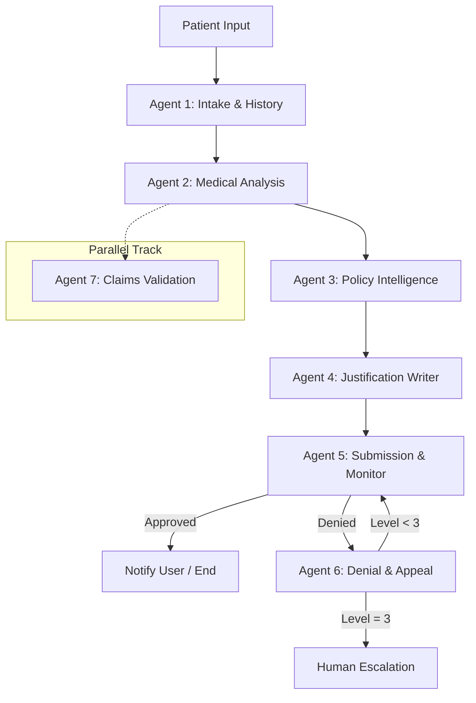

# 🏥 MediAuth AI — Autonomous Insurance Authorization & Appeal Ecosystem


**MediAuth AI** is a state-of-the-art multi-agent agentic AI system designed to autonomously manage the full insurance authorization lifecycle. By leveraging 7 specialized AI agents coordinated through a LangGraph state machine, it automates patient intake, clinical analysis, policy verification (RAG), justification writing, and an autonomous appeal loop.

---

## 🏗️ System Architecture

MediAuth AI follows a modular, agentic architecture where specialized agents handle specific domains. The **LangGraph Orchestrator** manages the state and handles cycles (specifically the appeal loop).



---

## 🚀 Key Features

- **Autonomous Appeal Loop:** Agent 6 automatically parses denials, finds counter-evidence, and re-submits for up to 3 levels.
- **Policy RAG:** Uses **ChromaDB** to perform Retrieval-Augmented Generation over insurance policy PDFs.
- **Dynamic Prompt Management:** All agent prompts are stored as YAML files, editable via the UI without code changes.
- **Clinical Precision:** Powered by **Claude Sonnet 4** for high-fidelity medical writing and reasoning.
- **Cross-Platform UI:** A beautiful **Flutter** dashboard for hospital staff to monitor the auth lifecycle.

---

## 🛠️ Tech Stack

| Layer | Technology |
|---|---|
| **LLM Core** | Claude Sonnet 4 (Anthropic API) |
| **Agent Framework** | LangGraph (Python) |
| **Backend API** | FastAPI (Python) |
| **Frontend** | Flutter (Dart) |
| **Database** | PostgreSQL + SQLAlchemy |
| **Vector Store** | ChromaDB (Local) |
| **Containerization** | Docker + docker-compose |

---

## 📂 Project Structure

```text
MediAuth-AI/
├── backend/                # Python FastAPI + LangGraph
│   ├── agents/             # 7 Specialized AI Agents
│   ├── api/routes/         # REST Endpoints
│   ├── models/             # SQLAlchemy DB Models
│   ├── prompts/            # Agent Prompts (YAML)
│   ├── knowledge_base/     # ChromaDB + Policy PDFs
│   └── tests/              # Pytest & Postman
├── mediauth_flutter/       # Flutter Frontend
├── docker-compose.yml      # Multi-container setup
├── build.md                # Detailed build plan
└── handoff.md              # Project handoff & state
```

---

## ⚡ Quick Start

### Prerequisites
- Python 3.11+
- Flutter 3.x
- PostgreSQL 15+
- Docker Desktop (Optional)

### 1. Backend Setup
```bash
cd backend
python -m venv venv
source venv/bin/activate  # Windows: venv\Scripts\activate
pip install -r requirements.txt

# Create .env from .env.example and add ANTHROPIC_API_KEY
cp .env.example .env

# Initialize Database
python models/init_db.py
python knowledge_base/loader.py

# Start Server
uvicorn api.main:app --reload
```

### 2. Frontend Setup
```bash
cd mediauth_flutter
flutter pub get
flutter run -d chrome
```

### 3. Docker Launch
```bash
docker-compose up --build
```

---

## 🤖 The 7 Specialized Agents

1.  **Intake & History:** Transforms raw text into structured JSON patient profiles.
2.  **Medical Analysis:** Maps clinical data to ICD-10/CPT codes.
3.  **Policy Intelligence:** Performs RAG over policy documents to identify coverage gaps.
4.  **Justification Writer:** Generates persuasive, medically-accurate auth letters.
5.  **Submission & Monitor:** Interface with insurer portals (Mocked for MVP).
6.  **Denial & Appeal:** Handles the autonomous multi-level appeal cycle.
7.  **Claims Validation:** Pre-scans billing codes to minimize risk before submission.

---

## 🧪 Testing & Deployment

- **Backend:** Run tests using `pytest tests/ -v`.
- **API Documentation:** Accessible at `http://localhost:8000/docs` (Swagger).
- **Deployment:** Optimized for Render.com (Backend) and Vercel/Render Static (Frontend).

---
